# Loggbok

## 23/03
Gjorde klart första versionen av GUIn för projektet. Ganska nöjd med den
men den kan säkert förbättras.
Nästa gång jag jobbar så tänker jag jobba med att få in dynamisk rendering
av ui och få in reddit APIn med inloggning.
Screenshot: 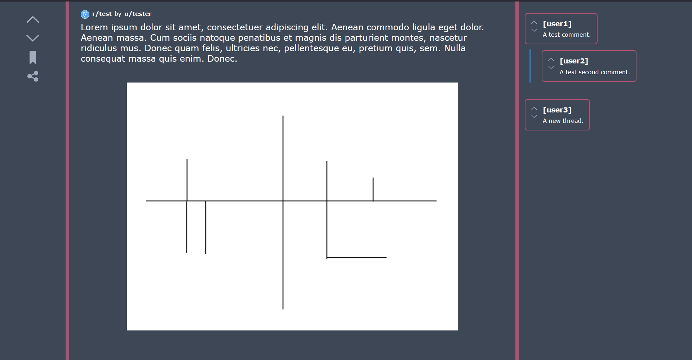
Kanske ska lägga inloggnings knappen nere i vänstra hörnet.

## 14/04
Updaterade UI'ns grännsnitt och la in en inloggnings knapp. Just nu så skickar den dig till /login/callback
och gör ingeth annat. Jag tänker fixa så att /login/callback fungerar nästa gång jag jobbar.
Screenshot: 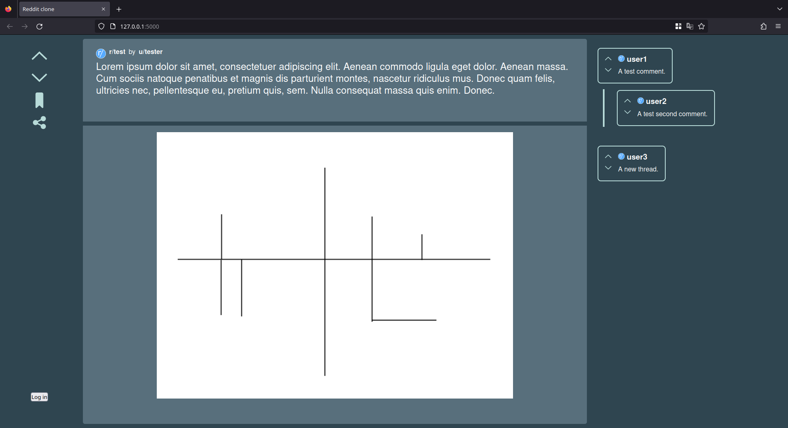

## 15/04
Jobbade på att få in reddit OAuth2. Jag kommer att ha mardrömmar om "Internal Server error", "unsupported_grant_type" och "401".
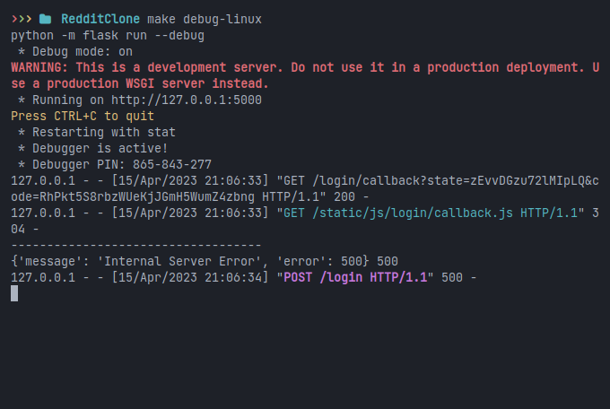

## 16/04
Jag har nu tillgång till reddits API via OAuth2. Det är ganska löjllight hur det fungerar. Annars har jag inte gjort så mycket mer. Jag la till `RedditAPI` classen och lite checkar. Idé till nästa gång / saker att komma ihåg: http://localhost:5000?u/{user} istället för http://localhost:5000/u/{user} detta gör att jag inte behöver använda servern så mycket och allt hanteras client-side. Nästa gång ska jag också jobba på code cleanup och förbättringar samt lägga till mer API funktioner. Jag behöver också sätta upp så att Flask använder Babel transpiler ES6->ES5 med [@babel/plugin-proposal-decorators](https://babeljs.io/docs/babel-plugin-proposal-decorators)
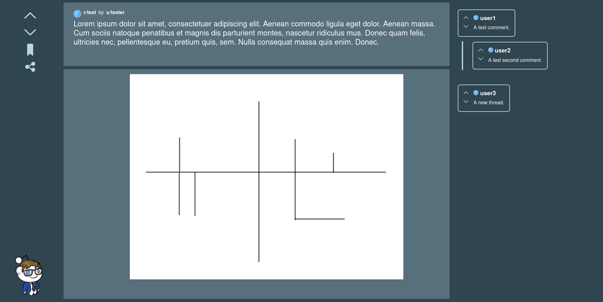
En video på en rolig bugg jag råkade göra:
<video src="./Snoo-jumpscare.mp4" controls="controls" style="max-width: 730px;"></video>

## 17/04
Idag jobbade jag mest på att få in typescript support i projectet. Det visade sig att det inte gick att få in Babel i Flask så istället kör jag `tsc -w` vilket kollar på alla typescript file och compilerar dem. Sedan måste jag också köra `flask --debug run` så att servern kör. Jag började också att lägga in dynamiska posts. Det har gått ganska bra förutom att jag inte kan sätta rätt width/height på bilden. Jag la också till en logga ut knapp.
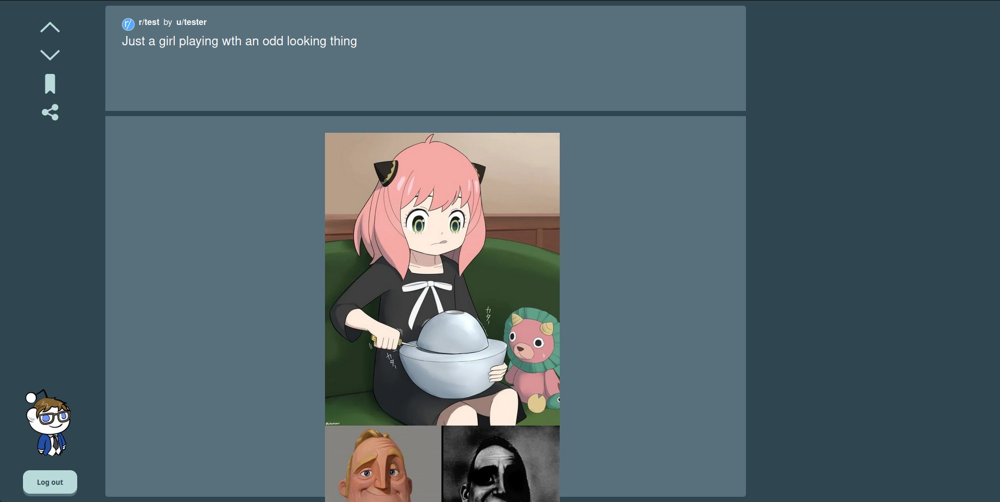
Till nästa gång så ska jag jobba med att fixa så att bilden är rätt storlek, Lägga till subbreddit och användare som postade, upvote/downvote/save/share och tillsist Kommentarer.

## 18/04
Försökte fixa bilden overflow men kunde inte. Ska nog skirva om hur jag gör posten. Ingen screenshot pga inga ändringar.

## 19/04
Idag började jag på omskrivningen på p-middle. Kom inte så långt eftersom jag bara hade ~45 minuter inklusive att skriva detta. 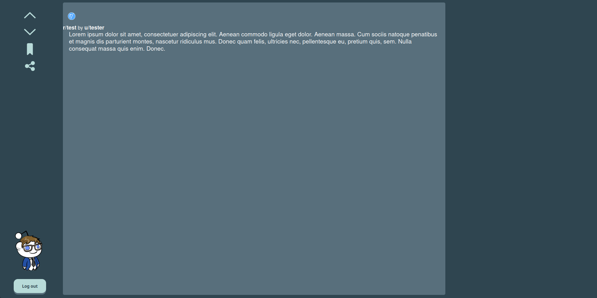

## 21/04
Idag fixade jag så att bilden scalar rätt och är centrerad. Jag började också jobba på att få in subreddit namn och username på postaren samt subbreddit logo caching (för att inte spamma api'n). 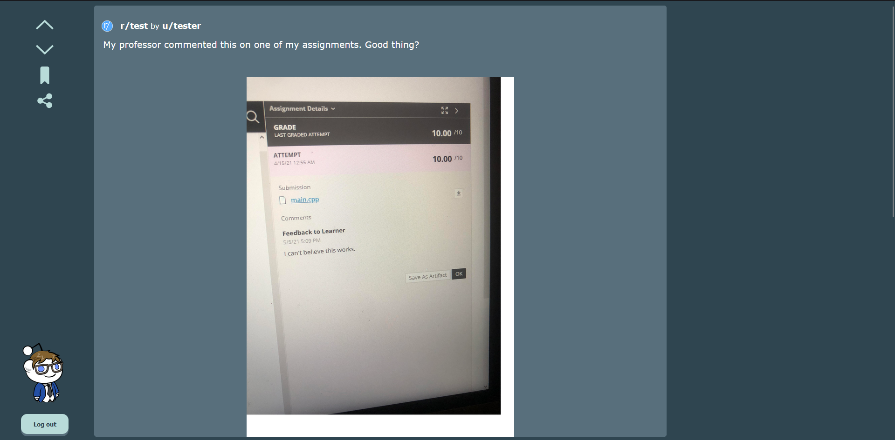

## 22/04
Idag skulle jag jobba på tiktok scroll. Meeeeeen.... Utan någon anledning slutade reddit APIn att fungera. Jag kunde inte hämta min profil bild. Det fungerar i postman men inte i javascript. Inget mer att säga.

Några timmar senare så testade jag igen och då bara fungerade det... Vet ej varför men det är Reddit så... Anyway jag la till en ny Caching class som ska cacha saker som din profil bild och subreddit logor. Detta för att inte spamma reddits api. Till nästa gång ska jag jobba med att lägga in så att posts är web components. Ingen screenshot pga inget har ändrats i front-end.

## 23/04
Idag jobbade jag med att få in dynamiska posts, web components, tiktok scroll och mer info på posten. Jag fick in allt och sedan fuckade jag upp genom att ta bort localStorage. Så nu måste jag bygga om det systemet.  (detta är hur det faktiskt ser ut)

## 25/04
Idag jobbade jag med att fixa så att feed:en fungerade även när du inte är inloggad och så jobbade jag på lite små fixar med css (subreddit iconer var inte runda och inte i toppen). Sedan började jag jobba på att få in DOMPurify så att jag kan använda text i .innerHtml() och inte få en XSS attack. Jag la också till subreddit title och author. Till nästa gång ska jag fixa DOMPurify eller komma på en annan lösning.

(inloggad)
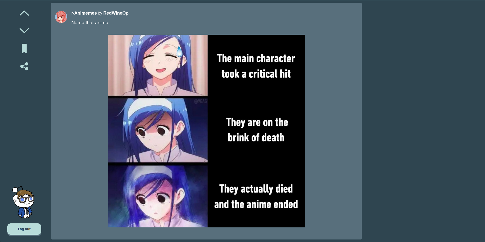
(utloggad)
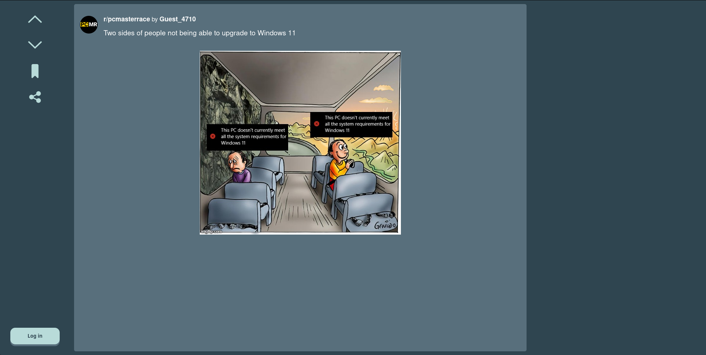

## 02/05
Jag fixade lite posts idag så att URLs fungerar ordentligt. Det är typ allt. Jag orkar knappt med detta projectet längre. Det har blivit bara frustrerande. Så jag kanske avslutar det här och börjar skriva min rapport.

## 05/05
Idag la jag till så att man kan sharea och spara posts.

## 06/05
Idag så la jag till images i text och lite bugg fixar. Inga stora ändringar. Nästa gång ska jag jobba på Upvote/Downvote plus att fixa så att checkmark på bookmark inte hamnar i the backrooms.

## 09/05
I DID IT I GOT `[object Object]` I HAVE PEAKED.
Reddit servrarna har en konstig bugg då om du `downvotar` och sedan `upvotar` med en external API (e.g inte officiella appen) så buggar upvote statusen på reddit. Samma sak kan hända fast om du byter på ordningen. 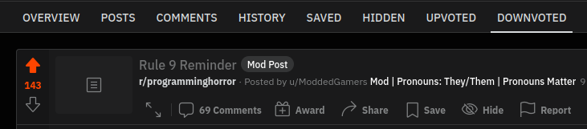
Lösningen är att skicka en extra packet som säger ta bort upvote/downvote. Innan du sickar upvoten eller downvoten. 

Idag la jag till lite comfort med t.ex bekräftelse när du kopierar en länk och spara en post. Lite små tweaks I UI:n. La också till så att jag använder `self_html` om det är en `self_post`. Jag har också lagt till så att du kan gå in på subreddits och användare och kolla igenom posts där. Nästa gång *kanske* jag implementerar kommentarer. Men det kanske blir lite för svårt.
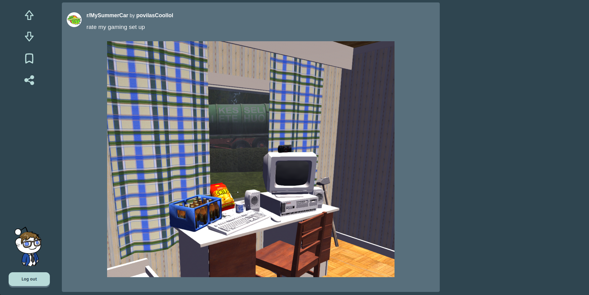

## 11/05
Idag började jag jobba på att få in kommentarer igen. För att jag råkade radera den gammla implementation så behövde jag göra om den :( Men det gick tillslut. 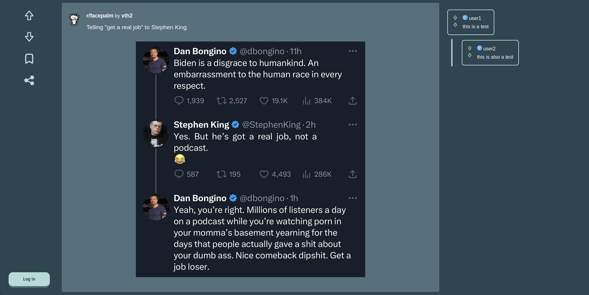 Nu jobbar jag på att göra det till en web component så att jag kan dynamiskt ladda kommentarer. Men jag kanske inte hinner och måste istället skriva rapporten imorgon. Vi får se.

---

## Important Todo
 - [x] fixa save
 - [x] positive comformation
 - [x] Add conformation when sharing/saving
 - [x] Fixa log out bugg
 - [x] Upvote
 - [x] Downvote

## Todo
 - [x] prototyp av frontend
 - [x] Reddit OAuth2 API
 - [x] ~~Complete /login/callback~~
 - [x] Log out button
 - [x] Typescript support
 - [x] Rewrite p-middle
 - [x] "Tiktok" scroll
 - [x] Save funktionalitet
 - [x] Share funktionalitet
 - [x] URL posts (embeds?)
 - [x] DOMPurify
 - [x] Text posts
 - [x] Rewrite p-left
 - [x] Web componenets
 - [x] whenDefined(name)
 - [ ] General post formating
 - [ ] Code formating
 - [ ] Post formating
 - [ ] Video posts
 - [ ] Dynamiska kommentarer
 - [ ] Upvote funktionalitet
 - [ ] Downvote funktionalitet
 - [ ] Dynamiska posts.
 - [ ] Ta bort flask
 - [ ] ~~Babel transpiler i Flask~~

## Jobbar på
 - Dynamiska posts
 - Web componenets
 - DOMPurify
 - ~~Rewrite p-left~~

## Wishlist
*Saker jag vill göra men kanske inte hinner med.*
 - Dynamisk gui
 - Tauri support
 - Ta bort python och lägga till github sites

## Buggar
 - ~~Checkmark svg:n drar åt helvete.~~
 - ~~!important Resfreshing token alldeles för tidigt.~~
 - ~~log out knappen tar inte bort `me` från cache~~
 - ~~När man loggar in så laddars inte token och du måste refresha sidan.~~
 - ~~Inga posts laddar om du inte är inloggad~~